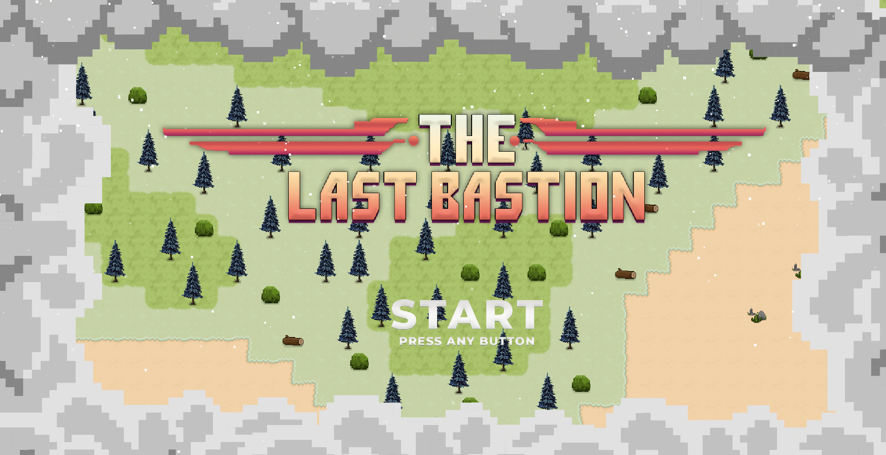
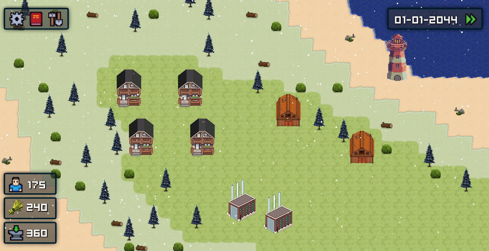
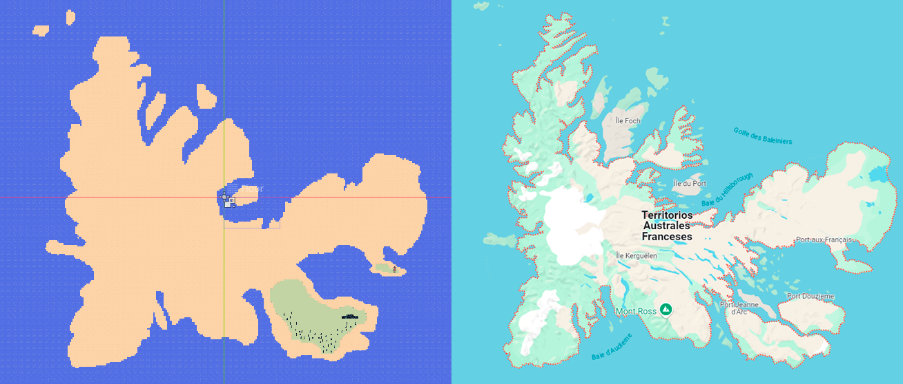

# The Last Bastion

## Descripción

**The Last Bastion** es un juego de construcción de ciudades (*City Builder*) desarrollado en Godot 4.3. Actualmente estamos trabajando en una pre-alfa/demo para mostrar el núcleo del juego.

## Características

- **Construcción de ciudades:** Administra recursos, expande tu territorio y construye infraestructuras esenciales.
- **Gestión de economía y recursos:** Asegura el desarrollo sostenible y la supervivencia de tu ciudad.

## Imágenes

### Título del Juego
Una vista del título principal del juego que muestra la atmósfera y estilo visual.

### Vista Previa del Juego
Una captura que muestra la interfaz de usuario y la jugabilidad principal.

### Comparación del Mapa
Una comparación visual del desarrollo del mapa comparado con la realidad.

## Página Web
Visita nuestra [Página Web Oficial](https://thelastbastion.aquero.es) para más información.

### Comunidad
En nuestra página web encontrarás un apartado dedicado a la comunidad donde puedes interactuar con otros jugadores, compartir ideas y participar en discusiones sobre el desarrollo del juego.

### Descargas
Accede a la sección de descargas para obtener la última versión disponible del juego.

## Repositorio de la Página Web
Revisa el código de la página web en nuestro [GitHub](https://github.com/QueroXD/TheLastBastion_Site).

## Estado del Proyecto
Actualmente en desarrollo, enfocándonos en el lanzamiento de una pre-alfa/demo.

## Contribuciones
¡Estamos abiertos a contribuciones! Revisa nuestras guías de contribución en el repositorio.

---

*Gracias por tu interés en The Last Bastion. ¡Construye, defiende y prospera!*

